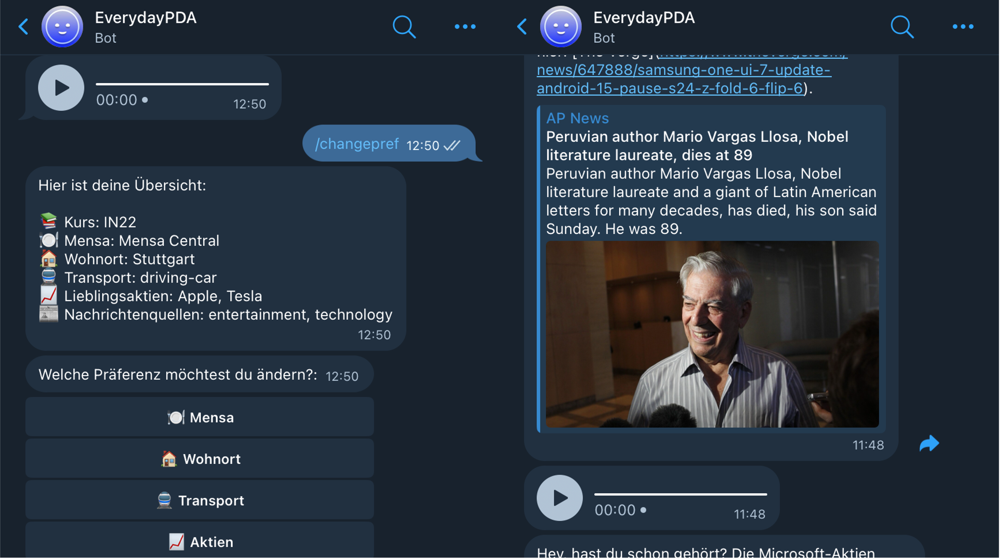

# EverydayPDA

## Start Application

Start Docker:
```bash
docker compose up -d --build
```

## Telegram

After starting the Bot, you can add it to your Telegram contacts (@EverydayPDA_bot).

## API

The REST API is running on [Localhost](http://localhost:8000) with a complete [documentation](http://localhost:8000/docs).

However, you need to start [Docker](#docker) for this.

## Screenshots

## Coverage


| Datei | Coverage (%) |
|---|---|
| backend/Informations.py | 100.0% |
| backend/UseCases.py | 100.0% |
| backend/api/answer_processor.py | 100.0% |
| backend/api/data_filler.py | 100.0% |
| backend/api/database.py | 75.0% |
| backend/api/database_utils.py | 95.2% |
| backend/api/main.py | 81.8% |
| backend/api/models.py | 100.0% |
| backend/api/summary_generator.py | 95.1% |
| backend/api/usecase_handler.py | 60.0% |
| backend/llm_fetchers/ChatGPTProcessor.py | 78.7% |
| backend/llm_fetchers/UseCaseProcessor.py | 54.9% |
| backend/service_fetchers/canteen_service.py | 98.2% |
| backend/service_fetchers/flight_service.py | 94.1% |
| backend/service_fetchers/helpers.py | 100.0% |
| backend/service_fetchers/hotel_service.py | 100.0% |
| backend/service_fetchers/news_service.py | 87.5% |
| backend/service_fetchers/rapla_service.py | 100.0% |
| backend/service_fetchers/stock_service.py | 85.3% |
| backend/service_fetchers/traveltime_service.py | 100.0% |
| backend/service_fetchers/weather_service.py | 100.0% |
| frontend/api_client.py | 98.5% |
| frontend/bot.py | 100.0% |
| frontend/command_handlers.py | 100.0% |
| frontend/message_handlers.py | 92.7% |
| frontend/pref_config.py | 100.0% |
| frontend/pref_handler.py | 60.2% |
| frontend/speech_utils.py | 100.0% |
| frontend/start_handler.py | 75.2% |
| **Projekt** | **86.3%** |
